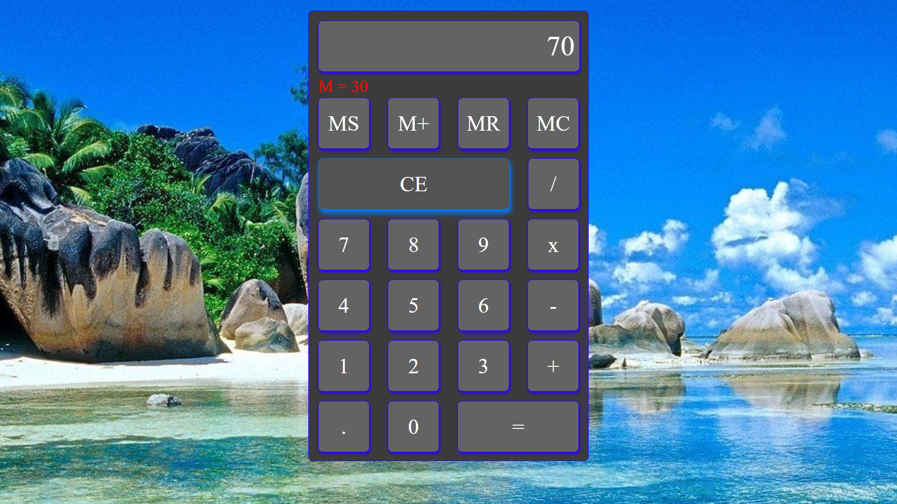

<h1>Vanilla Javascript Calculator App</h1>

Built a Calculator App with HTML, CSS, and Javascript

You can check it out [here](https://jerryvw.github.io/calculator/)

<h2>Summary</h2> 

Building this caclulator app was a lot of fun. I really got a good handle on using the debugging tools in Chrome because I continuosly had to put in stops at different points to see what was going wrong. This really helped me develope an understanding of how the code runs based on what the statements are looking for. Plus on how the program cycles through the logic and how one thing will not work if it is before/after another.
 

I also learned about bubbling. This made it a lot easier to add one event listener to an entire batch of buttons. I used switch statements for my calculations and memory buttons to simpllify the functionality of the calculator. All in all, I loved working on this project.

<h2>Author</h2>

JerryVander Weide - Full-Stack Developer [My Website](https://jerryvw.github.io/jerryvanderweide-site/) & [LinkedIn](https://www.linkedin.com/in/jerry-vander-weide-ba0586101/)
